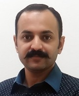

<!---->

Assistant Professor  
Reseach Center for Modelling and Simulation  
National University of Sciences and Technology, Islamabad  
Phone: +92 51 9085 5737

&nbsp;
  
## Profile
Dr. Shahzad Rasool is an Assistant Professor at [Research Center for Modeling and Simulation (RCMS)](http://www.nust.edu.pk/INSTITUTIONS/Centers/RCMS/Pages/default.aspx), [National University of Science and Technology (NUST)](www.nust.edu.pk) since August 2016. He received his Ph.D. from [Nanyang Technological University (NTU)](www.ntu.edu.sg), Singapore in 2014, M.Sc. degree in [Communication Engineering](www.master.ei.tum.de) from [Technische Universität München (TUM)](www.tum.de), Germany in 2009 and B.Sc. in Electrical Engineering from [University of Engineering and Technology (UET)](www.uettaxila.edu.pk), Taxila, Pakistan in 2006. In 2008, he worked as a research intern at DOCOMO Communications Laboratories Europe, Munich. From 2014-2016, he worked as a Research Fellow at the [Immersive Mathematics Lab](https://www.ntu.edu.sg/home/assourin/research.htm) of [Fraunhofer IDM @ NTU](www.fraunhofer.sg), Singapore. The recent focus of his research is on applications of immersive interaction and his research interests include haptics, virtual reality, HCI and computer vision.

## Teaching
*	CSE-867 	Virtual Reality					Fall 2017, 2018, 2019
*	CSE-865 	3D Geometric Modeling and Reconstruction		Spring 2018, 2019, 2020
*	CSE-868 	Human Computer Interaction			Spring 2018, 2019, 2020
*	EE-851 	Advanced Digital Communication Systems		Fall 2017, 2018, 2019
*	CSE-832 	Communications Systems and Networks		Fall 2016, Summer 2017
*	SYSE-805 	System Engineering Project Management		Spring 2017
*	RM-898 	Research Methodology				Fall 2016, Spring 2017

## Education
* BSc Electrical Engineering, 2003 – 2006  
 University of Engineering & Technology (UET), Taxila  
* MSc Communication Engineering, 2007-2009  
 Technical University of Munich (TUM), Germany
* PhD (Computer Engineering), 2010 – 2014  
 Nanyang Technological University (NTU), Singapore
