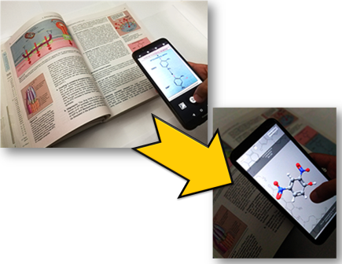
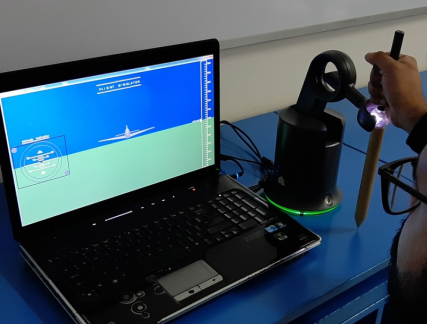
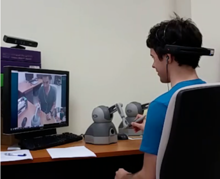
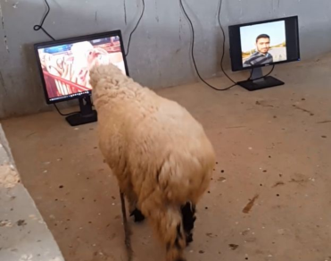
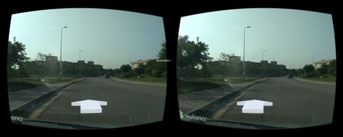
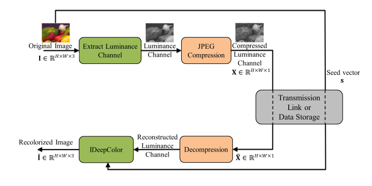

# Research Themes

The current focus of my research is on interdisciplinary applications falling under two areas.

## Immersive Interaction  
 ### Chemmersive: Interactive visualization of chemical structures  
   

* Integration of spatial skills and conceptual knowledge is essential for comprehension of chemistry concepts. However, model perception along with the understanding of spatial processes and spatial structures of molecules has been a cause of difficulty for students as conventional teaching methods cannot fully aid student comprehension. We investigate if the spatial learning process of   students can be aided by automatically creating a link between 2D representations of chemical structures and 3D molecular visualization. 

 ### Multimodal input  
 
    

* Flying an unmanned aerial vehicle (UAV) is a challenging task, due to the absence of direct sensory information such as a view of surroundings, sound, vibrations, and motion. It is important to provide these sensory stimulations to an operator for better situational awareness and efficient control. We study the effects of incorporating haptic feedback in UAV flight control. The research is aimed at investigating the hypothesis that while the presence of accurately modeled haptic forces provides better control of a UAV, unrealistic or exaggerated forces may produce better handling of the aircraft. We further investigate the role of haptic feedback in UAV handling varies for different phases of flight. A single force model may not produce better navigational control across all phases of flight.  
* We study the utility of different physiological measures i.e. heart rate variability (HRV), Galvanic Skin Response (GSR), pupil dilation, brain activity (different brain waves), facial features and different subjective measures to assess operator workload in a single operator-multivehicle command and control simulation. We explore different algorithms of mental workload and fatigue detection using EEG.  

  

* We explore ways of using existing video communication tools to achieve a higher sense of immersion through haptic feedback. Different interaction devices are used by the local user to control a remote haptic devices operated by the remote user. Efficient methods of generating haptic forces are explored. They are derived from the image/video content or transmitted asynchronously eliminating the need to modify existing communication tools.  
  
The aim is to minimize the amount of information exchanged and reduce the network transmission delay so that seamless interaction can be achieved. We investigate the tradeoff that exists between the quality of haptic feedback and cost of such a system. Application scenarios can be envisaged where such tangible video communication can be very useful.  

&nbsp
  

 ### Immersive Visualization   
 
   

* We attempt to increase the level of immersion to applications not traditionally considered for immersive visualization. Can we train animals through AR? Animals have the cognitive ability just like humans but understanding of animal cognition is limited in comparison. We investigate if we can manipulate animal behavior using Augmented Reality and if yes, then upto what extent. Special head mounted displays are designed, experiments to gain insights into 3D vision and acceptable frame rates of sheep are conducted.  

  

* Can we use low-cost head-mounted displays for immersive visualization to aid drivers? In-house algorithms for navigation are developed and implemented into a proof-of-concept application for AR navigation, within NUST H-12 campus, by placing directions directly in the FOV.  

&nbsp
  

## Vision and Graphics  
 ### Grey is the new RGB?   
  

* GAN-based image colorization techniques are capable of producing highly realistic color in real-time. Subjective assessment of these approaches has demonstrated that humans are unable to differentiate between a true RGB image and a colorized image. In this work, we evaluate the fidelity of such colorization and for the first time analyze the GAN-based image colorization scheme in the context of image compression. Our analysis shows that the palette (set of colors) recommended by the GAN-based framework is very limited even for highly realistic interactive colorization. We propose two novel methods of automatic palette generation that allows for the GAN-based framework to be useful for image compression. We demonstrate that provided true colors at a few pixel locations, GAN-based approach results in good spread of color to other image regions. Subjective analysis on a number of public datasets shows that the current system has low fidelity but performs better than JPEG at low data rate regimes.  
 ### Few-shot object detection in aerial images  
* Object detection has attracted a lot of research due to remarkable breakthroughs in the field of deep learning. Yet it remains only a partially solved problem, with state-of-the-art methods achieving barely satisfactory mean accuracy on benchmarks like MS COCO. The domain shift from real-life images to aerial imagery further adds the limitations of scarcity and disparity of data, large size of images, small size of objects apart from the challenges of scene complexity, variations in size and orientations, class imbalance and crowding of objects, to name a few. We investigate methods of object detection that can handle the such constraints to detect with high accuracy small objects in large images given few training examples while ensuring high computational efficiency.

# Research Students
1. Usama Ahmed 	_PhD CSE_	(2019-Present)
2. Umar Shahid 	_MS SYSE_ (2019-Present)
3. Usama Ehtesham 	_MS SYSE_ (2019-Present)
4. Muhammad Ali Bilal 	_MS SYSE_ (2018-Present)
5. Zain ul Abideen 	_MS SYSE_ (2018-Present)
6. Hassam Ahmed Malik	_MS SYSE_ (2018-2020)
7. Amal Fatemah 	_MS SYSE_ (2018-2019)
8. Hasnain Rashid 	_MS SYSE_ (2017-2019)
9. Aroosh Fatima 	_MS SYSE_ (2017-2018 )
10. Syed Rameez Rehman _MS SYSE_ (2016-2018)
11. Samin Kainat 	_MS SYSE_ (2016-2017)

